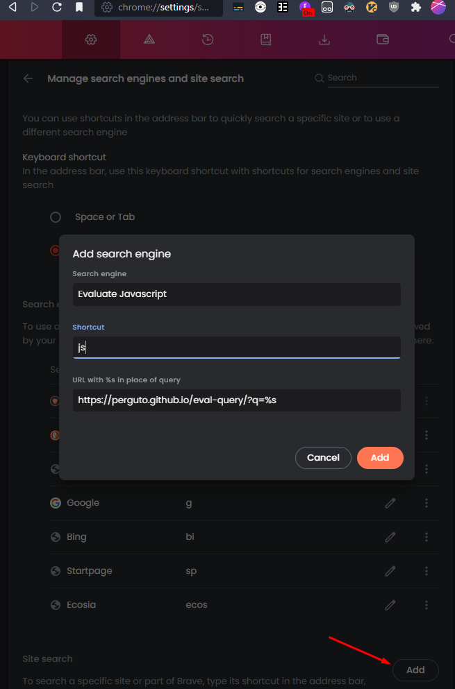

Put your query in the adress bar, after the `?q=`. Example: `https://perguto.github.io/eval-query/?q=2*3` will return `6`.

You can also add the site as a search engine to Chrome, Brave, Opera or Vivaldi by going to

[chrome://settings/searchEngines](chrome://settings/searchEngines), clicking on the `Add` button next to Site Search and entering `https://perguto.github.io/eval-query/?q=%s` as the URL

